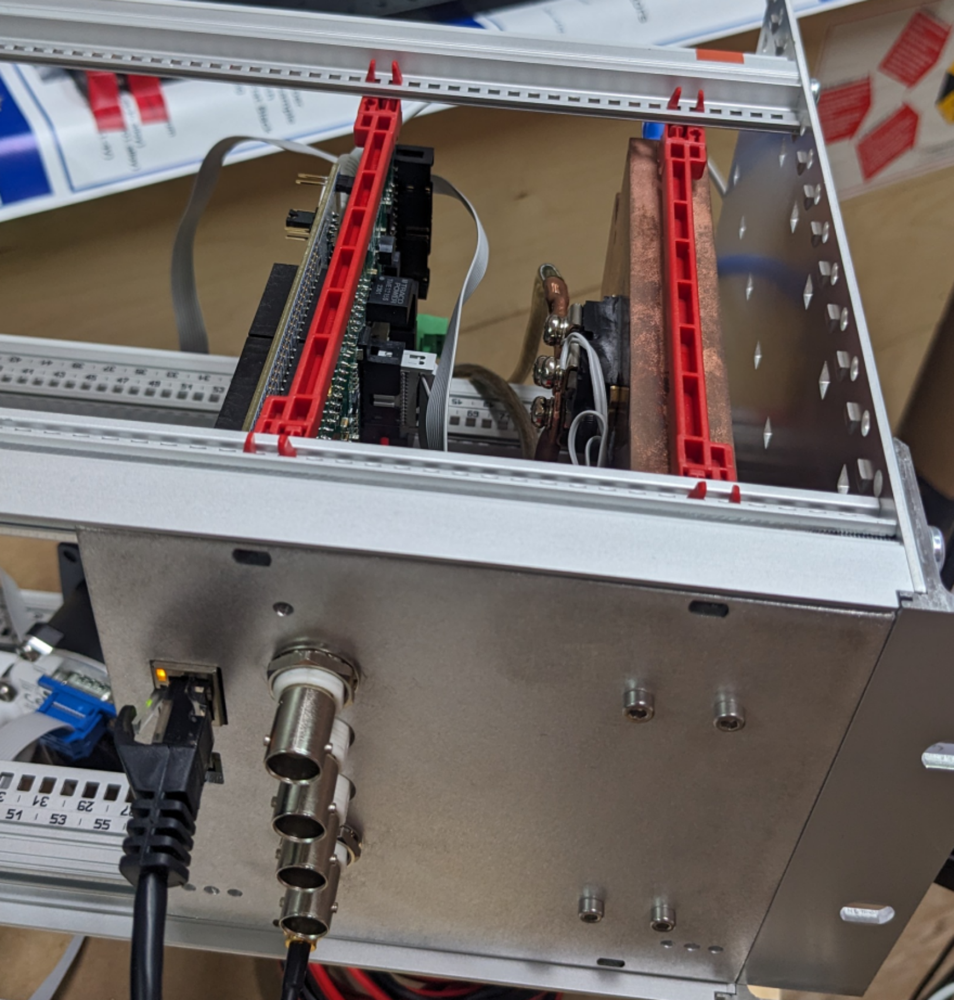
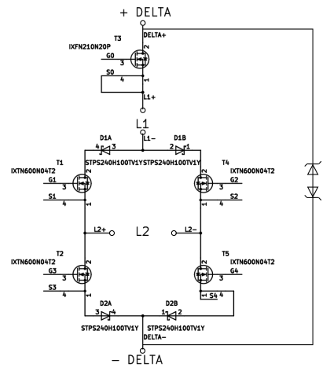
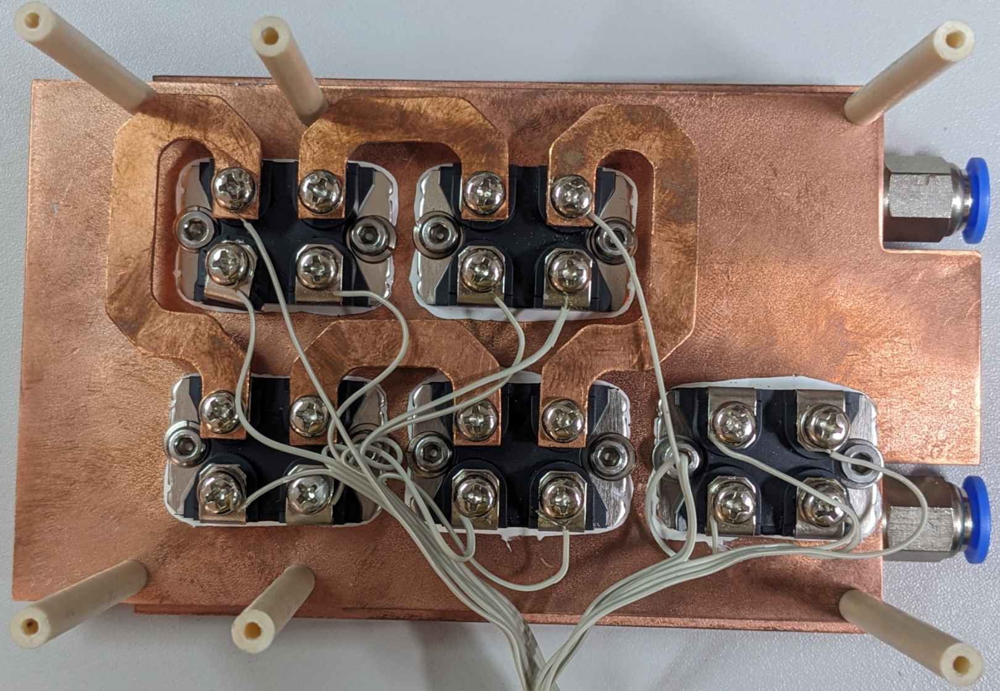
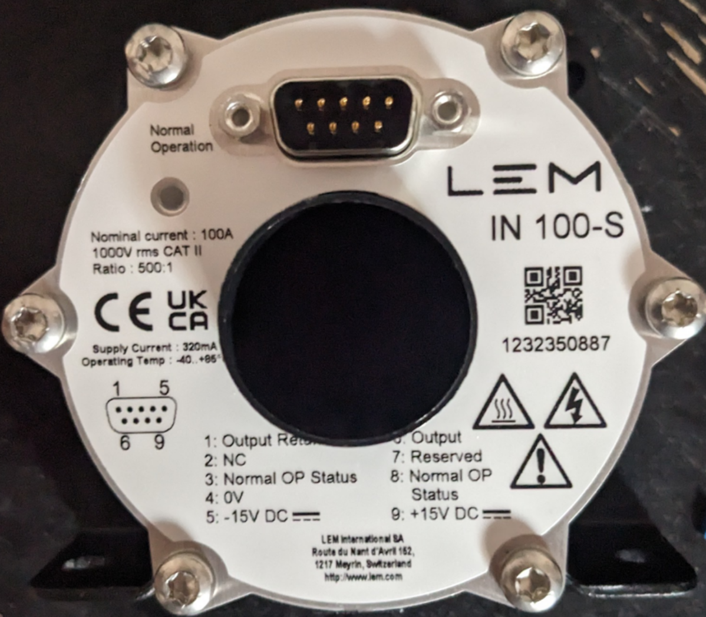
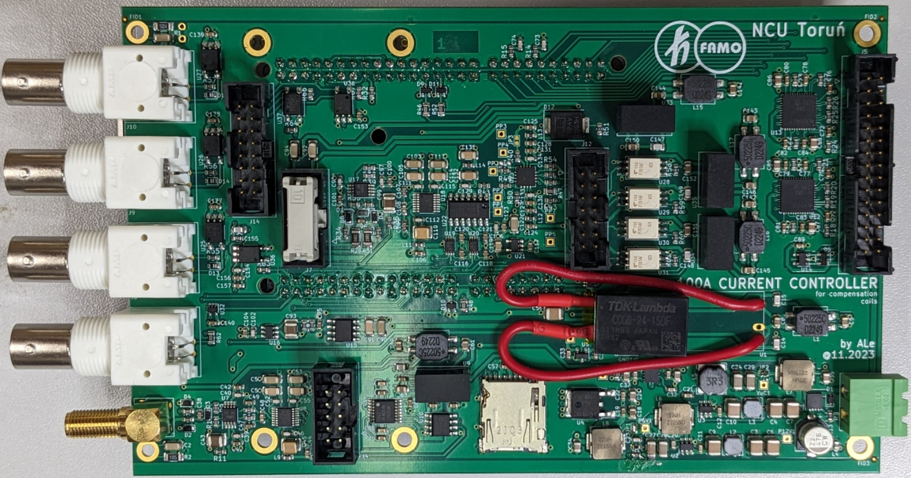
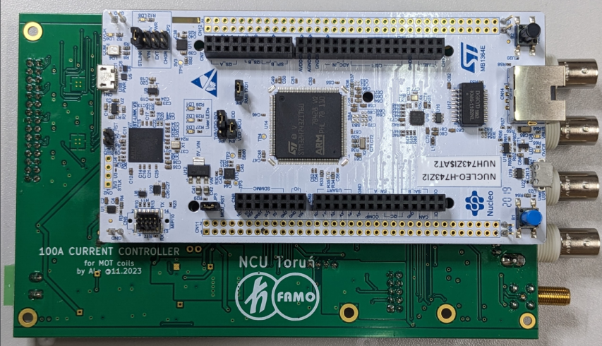
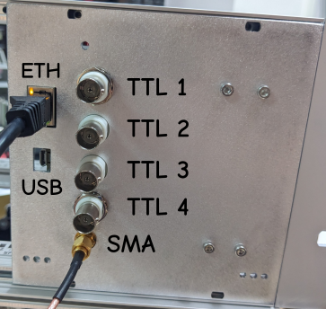

# current100A_Artiq
100A current driver compatible with Artiq. At the moment, device is compatible with Sinara package size and includes all Sinara connectors. There is no software compatibility yet.

## High power circuit

Power supply - two wires (+ and -) from Delta Power Supply. (will be WAGO connector asap).
Warning: 

Coil 1 (L1) - two wires from one coil (will be WAGO connector asap)

Coil 2 (L2) - two wires from second coil (this coil is direction switchable) (will be WAGO connector asap)

LEM IN 100-S is used for current measurement.

## Control board

Power supply MSTBA green connector (0 and +12V) for control board.

Ethernet - User Interface communication.

SMA input - (-10V to +10V) current control by voltage (from external control program). 1V -> 10A

4x BNC inputs - not used yet

USB micro - not used yet

# User Interface

User interface is available via TCP/IP on port 10. Depending on configuration IP address is static or taken from DHCP - this must be set when programming uC. After connecting to the device user is able to change setting by sending commands.

## Commands
### For basic control

`MODE 0` - switch off current

`MODE 1` - current control via voltage input (SMA input on front panel)

`MODE 2` - current control via ethernet user interface (`CUR` command)

`CUR 10.2` - set current 10.2 A (only in mode 2)

### Advanced settings

`I -0.04` - set gain -0.04 (this is bese gain for 50A - it is rescaled by uC for lower current due to udjust transistor characteristics)

# Issues

Please add your comments in `Issues` Github section (in top of this website).
