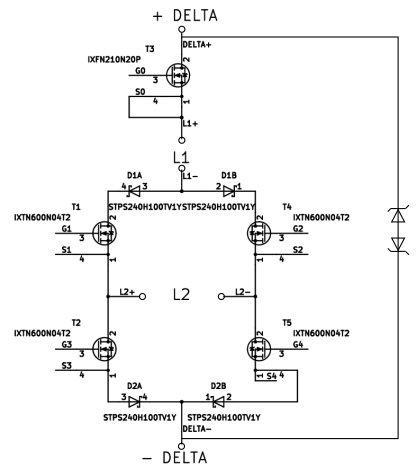
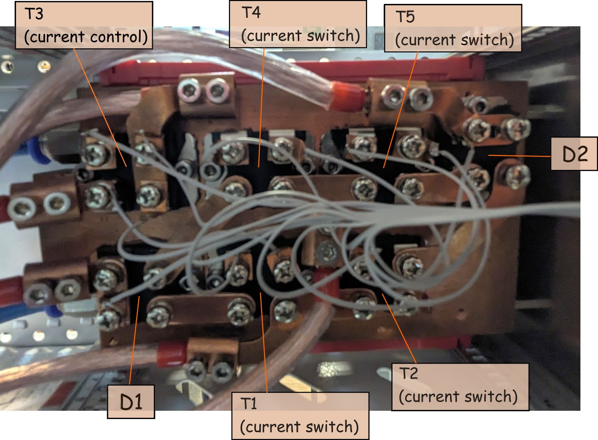
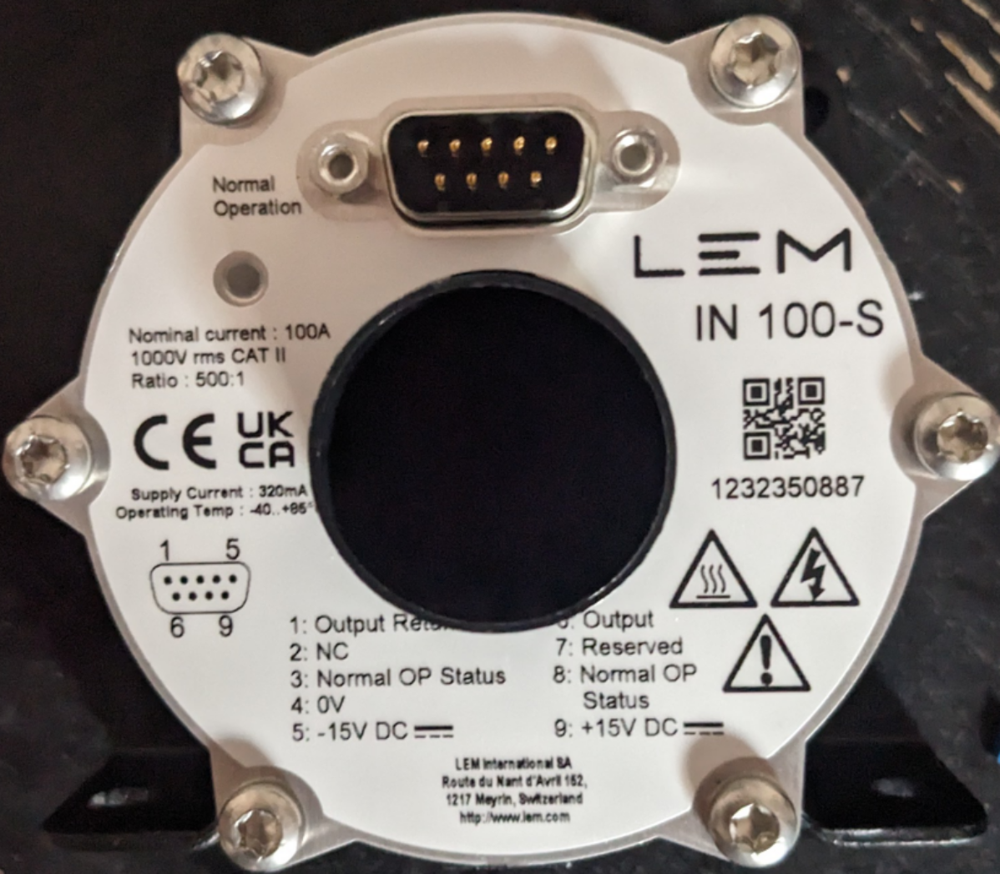
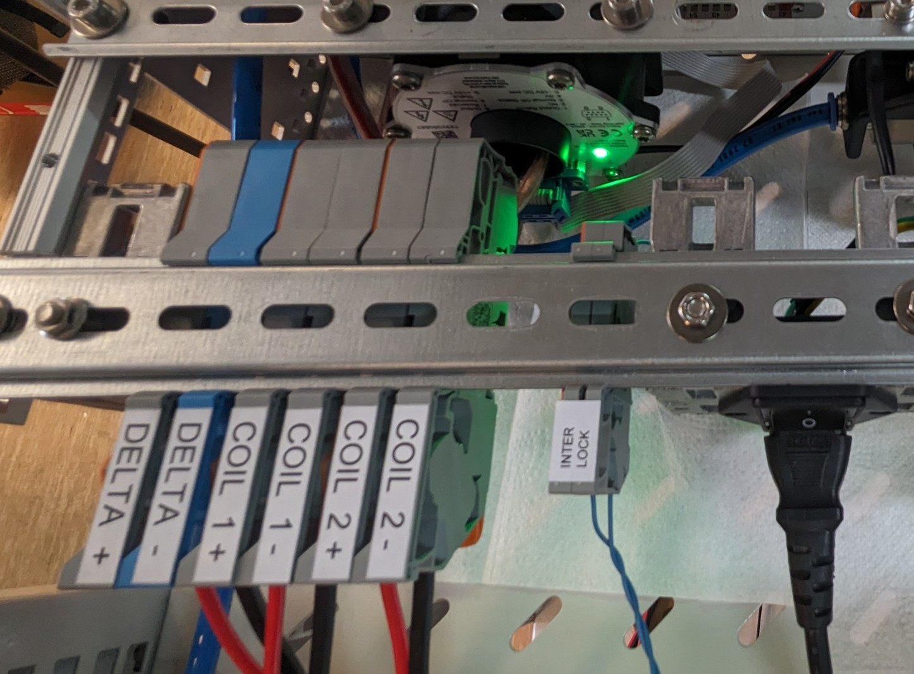
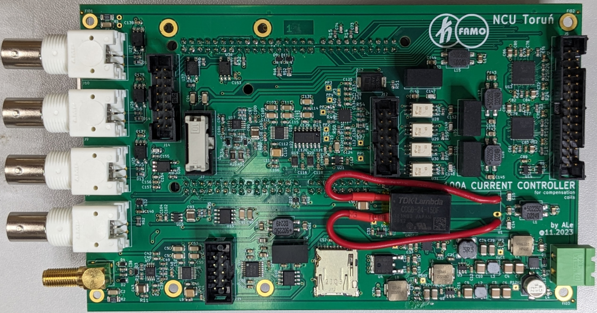
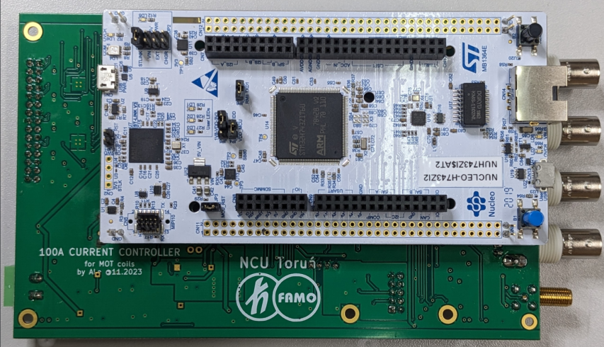
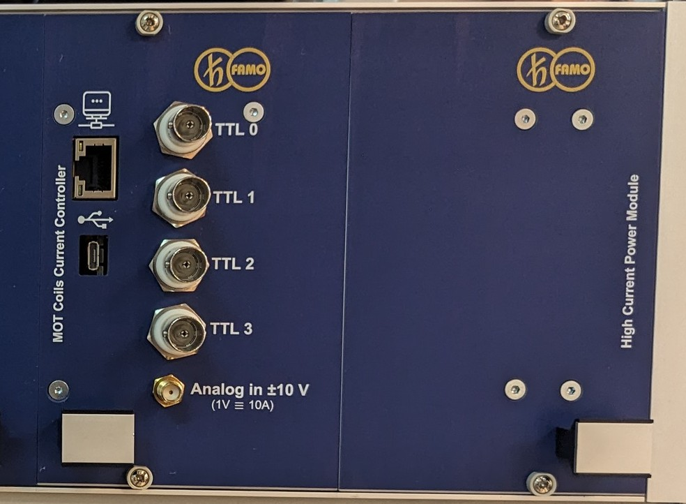

# current100A_Artiq
100A current driver compatible with Artiq. At the moment, device is compatible with Sinara package size and includes all Sinara connectors. There is no ARTIQ software compatibility yet.

## High power circuit

Power supply - two wires (+ and -) from Delta Power Supply.

 

Coil 1 (L1) - the first MOT coil.

Coil 2 (L2) - the second MOT coil. This coil is direction switchable (`DIR x` instruction).

LEM IN 100-S is used for current measurement.

## Control board

Power supply MSTBA green connector (0 and +12V) for control board.

Ethernet - User Interface communication.

SMA input - (-10V to +10V) current control by voltage (from external control program). 1V -> 10A

4x BNC inputs - not used yet

USB micro - not used yet

# User Interface

User interface is available via TCP/IP on port 10. Depending on configuration IP address is static or taken from DHCP - this must be set when programming uC. After connecting to the device user is able to change setting by sending commands.

## Commands
### Basic control

`MODE 0` - switch off current

`MODE 1` - current control via voltage input (SMA input on front panel)

`MODE 2` - current control via ethernet user interface (`CUR` command)

`CUR 10.2` - set current 10.2 A (only in mode 2)

`IMAX 25` - set max possible current value to 25A

`ERMAX 1` - max 1A change in each cycle (0.1ms)

### Advanced settings

`MODE 3` - set gate voltage using `VG` parameter

`I -0.04` - set gain -0.04 (this is bese gain for 50A - it is rescaled by uC for lower current due to udjust transistor characteristics)

`DIR x` - L2 coil current direction (x=-1: current positive, x=1: current negative, x=0: no current - all transistors blocked)

`DST x` - direction switching treshold; current direction switchin in coil L2 is possible only if absolute current value is less than x

`VG` - current gate voltage; in `MODE 3` is set manually

`CALIB 1` - gate voltage - current characteristics callibration. Improves current control.

`CALIB 4` - LEM zero current callibration (automaticaly done during startup)

# Issues

Please add your comments in `Issues` Github section (in top of this website).
